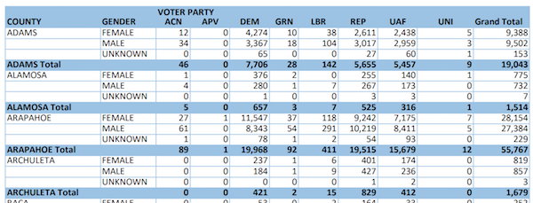

# Colorado early vote count PDF parser
Some Python to parse the current version of the Colorado Secretary of State's daily early vote total PDFs into a tidy CSV with one observation per line. It assumes that the structure of the Excel spreadsheet being saved as a PDF by the secretary's office, and the file naming convention, will remain consistent -- at least for this election cycle.

**[Before](https://www.sos.state.co.us/pubs/newsRoom/pressReleases/2018/20181026BallotsReturnedByAgePartyGender.pdf)**



**After**

```csv
report_date,county,gender,party,returned_votes
2018-10-26,ADAMS,FEMALE,ACN,12
2018-10-26,ADAMS,FEMALE,APV,0
2018-10-26,ADAMS,FEMALE,DEM,4274
2018-10-26,ADAMS,FEMALE,GRN,10
2018-10-26,ADAMS,FEMALE,LBR,38
2018-10-26,ADAMS,FEMALE,REP,2611
2018-10-26,ADAMS,FEMALE,UAF,2438
2018-10-26,ADAMS,FEMALE,UNI,5
2018-10-26,ADAMS,MALE,ACN,34
```

## Setup/usage
This uses [`pdfplumber`](https://github.com/jsvine/pdfplumber) to parse the PDF with [`pipenv`](https://pipenv.readthedocs.io/en/latest/) managing the dependency/virtualenv. Clone or download this repository and `cd` into the directory. Then:
- `pipenv install`
- `pipenv run python co-early-votes.py --pdf path/to/your/pdf`

Alternatively, of course, you can use your dependency management tooling of choice, or if you have pdfplumber installed globally on your machine, it'd just be: `python co-early-votes.py --pdf path/to/your/pdf`.